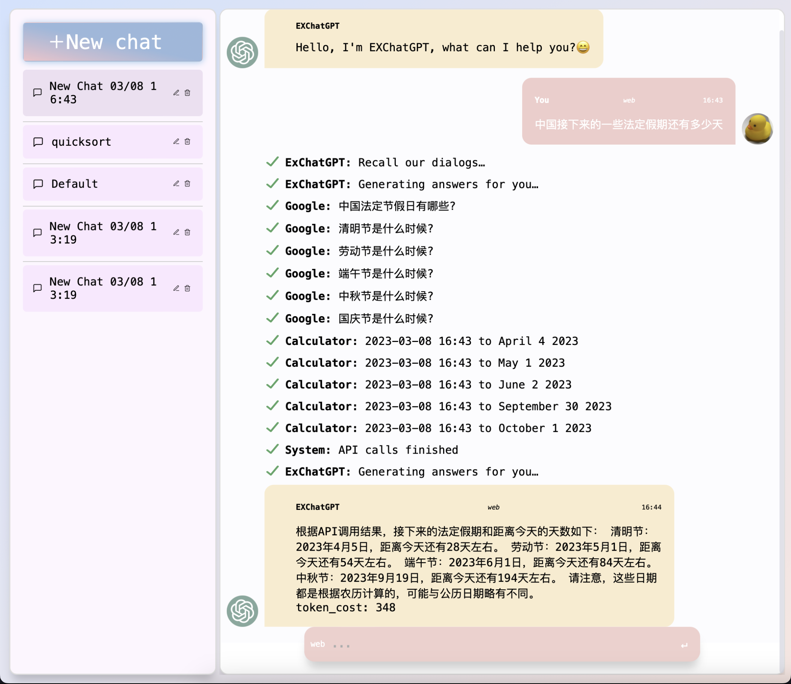

# Ex-ChatGPT - ChatGPT with ToolFormer

   

简体中文 [English](./README.en.md) / [Background](./BACKGROUND.md)

ChatGPT 无需调整就能自己作为toolformer, 生成问题的API请求来帮助回答。而 Ex-ChatGPT 使得 ChatGPT 能够自己调用外部 API，例如 WolframAlpha 和 Google, WikiMedia，从而给出更准确且具有时效性的回答。
本项目分为 Ex-ChatGPT 和 WebChatGPTEnhance，前者是使用 ChatGPT API 的服务，后者是浏览器插件。

## Highlights

- 支持 OpenAI GPT-3.5 Turbo API
- 允许 ChatGPT 调用外部 API 接口
- 可以使用 GPT-3.5 将外部接口返回的内容进行总结
- 自动保存载入对话历史，ChatGPT 可联系之前对话
- 可显示使用的 Token 数量
- openAI api key池
- Markdown and MathJax 渲染
- 调用API过程显示动画, 类似必应
- 历史对话管理载入,类chatgpt页面布局
- 快捷键快速选择模式`Tab`和发送`Shift+Enter`

## 安装

## Ex-chatGPT
- `pip install`
`pip install -r requirements.txt`
- 在 `apikey.ini` 中填入你的 API 密钥
  - `Google api key and search engine id` [apply](https://developers.google.com/custom-search/v1/overview?hl=en)
  - `wolframAlpha app id key` [apply](https://products.wolframalpha.com/api/)
  - `openAI api key`(新功能) 或 `chatGPT access_token`(旧版本) [apply](https://platform.openai.com)
- 运行 `main.py` 并打开 `http://127.0.0.1:1234/`
- 调整模式，例如 `chat,detail,web,webDirect,WebKeyWord`

## WebChatGPTEnhance

- 在 `chatGPTChromeEhance/src/util/apiManager.ts/getDefaultAPI` 中填入 Google API 信息
- 运行 `npm install`
- 运行 `npm run build-prod`
- 在 `chatGPTChromeEhance/build` 中获取构建好的扩展
- add your `prompts` and `APIs` in option page.
  - `APIs` and `prompts` examples are in `/WebChatGPTAPI`
  - `wolframAlpha` needs to run local sever - `WebChatGPTAPI/WolframLocalServer.py`

## 更新日志

- 支持 OpenAI GPT-3.5 Turbo API，快速且价格低廉
- 额外的 API 调用和搜索摘要，以提供更全面和详细的答案
- 更新捷键快速选择模式`Tab`和发送`Shift+Enter`
- 更新历史对话管理,支持载入删除保存历史对话

- update API calls processing animation

- 页面美化

- Markdown and MathJax renderer

- 更新聊天记录token优化器，web模式可以根据聊天记录进行响应；添加token成本计数器

- upate web chatmode selection in webpage and optimize the prompt and the token cost, and restrict the token limit.

- update better suppoer chinese query and add current date info

- update web chatmode and fix some bugs
- update api config
- 更新api池
- 自动保存载入对话历史，ChatGPT 可联系之前对话
