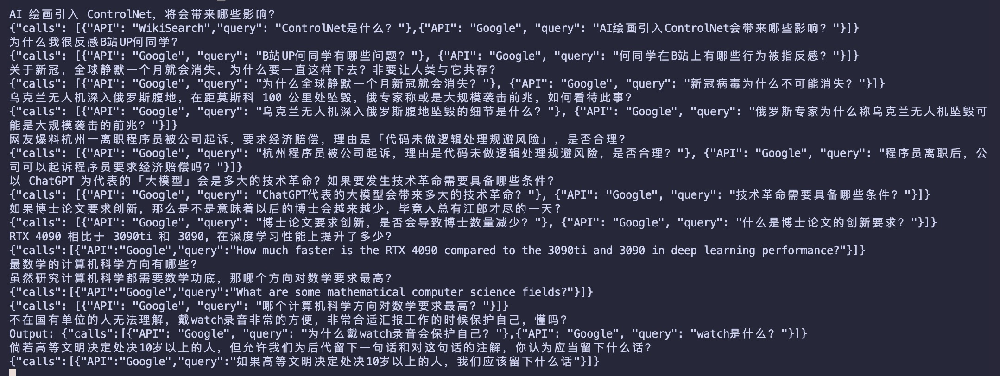
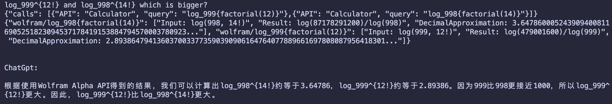
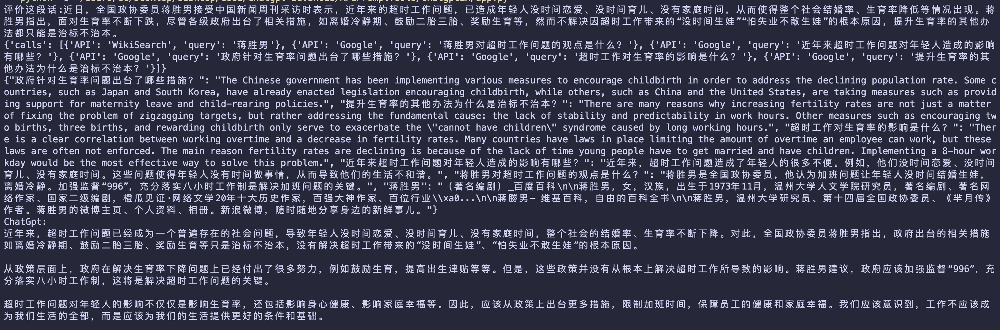
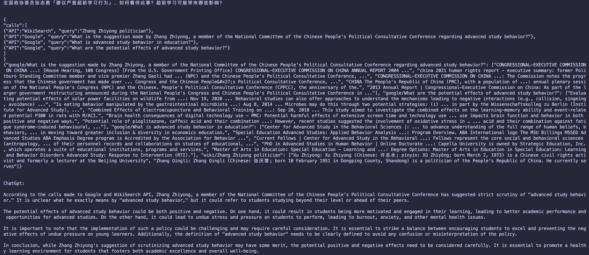
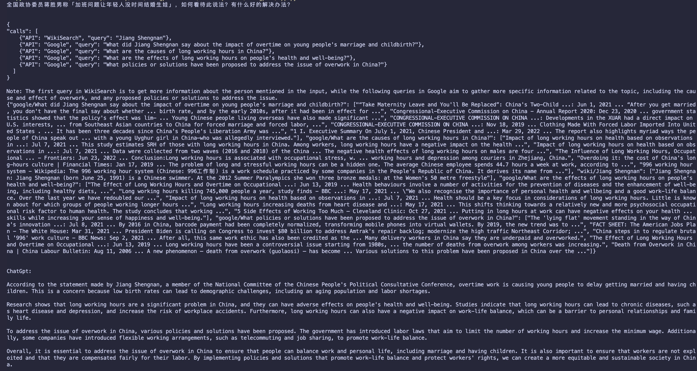
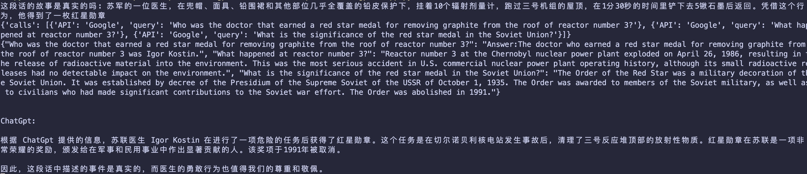

# EX-chatGPT introduction

## Background
"ChatGPT as Inherent Toolformer" means that ChatGPT has the ability to become a tool for various tasks without requiring additional adjustments.

However, ChatGPT has some limitations such as being unable to connect to the internet and difficulty solving math problems.

ToolFormer enables language models to use specific tools for different tasks. Can ChatGPT be equipped with ToolFormer's abilities?

The challenge is how to adapt ToolFormer's API generation process to ChatGPT.

Recent experiments demonstrate that given a specific prompt, ChatGPT has a natural ability to create APIs for text.

Therefore, it can be concluded that ChatGPT has inherent ToolFormer capabilities!

[Toolformer Paper](https://arxiv.org/abs/2302.04761)
the subproject WebChatGPT enchanced is based on [WebChatGPT chrome extension](https://github.com/qunash/chatgpt-advanced)

## Demo

[ExChatGPT-bilibili](https://www.bilibili.com/video/BV19Y411r7Bd/)
API call Demos:

QA Demos:

# Usage

## Ex-chatGPT
- `pip install`
`pip install -r requirements.txt`
- fill your `API keys` in `api_class.py` and `main.py`
  -  `Googgle api key and client id`
  -  `wolframAlpha api key`
  -  `openAI api key`
     -  use to summarize when there are too many querys
  -  `chatGPT access_token` 
     -  (yesterday, OpenAI has published the `GPT-3.5 Turbo API` , you can replace it with the newsest one)
- run the `main.py` and type your query

## WebChatGPTEnhance
- fill you `Googgle api key and client id` in `chatGPTChromeEhance/src/util/apiManager.ts/getDefaultAPI`
- run `npm install`
- run `npm run build-prod`
- get the extension in `chatGPTChromeEhance/build`
- add your `prompts` and `APIs` in option page.
  - `APIs` and `prompts` examples are in `/WebChatGPTAPI`
  - `wolframAlpha` needs to run local sever - `WebChatGPTAPI/WolframLocalServer.py`